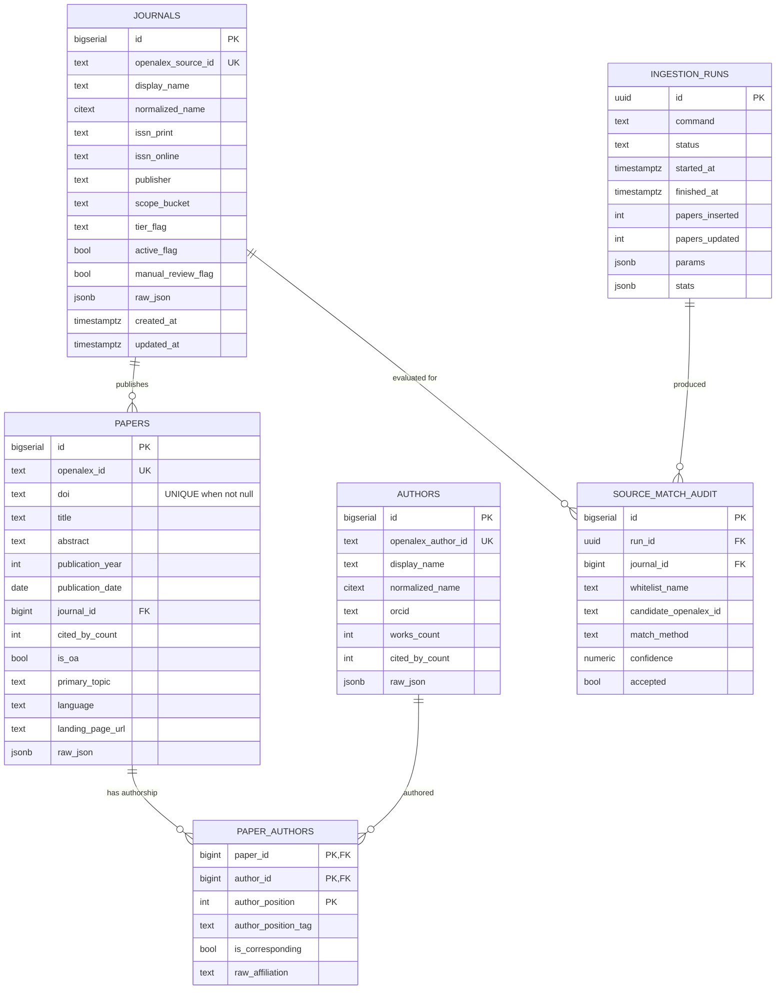

# Data Model (Stage 3)

PostgreSQL 16 is the source of truth. The schema is intentionally small: six tables cover the entire v1 product. Everything downstream (Typesense, the web app) is derived from these tables.

Source: [`infra/postgres/migrations/0001_init.sql`](../infra/postgres/migrations/0001_init.sql).

## ER diagram

## Tables

### `journals`
Canonical journal records. One row per whitelist entry. The `openalex_source_id` column is NULL until the Stage 4 `enrich-journals` step matches it to an OpenAlex `source`.

| Column                | Notes                                                                    |
|-----------------------|--------------------------------------------------------------------------|
| `id`                  | Surrogate PK used by foreign keys.                                        |
| `openalex_source_id`  | Unique. Populated by `enrich-journals`.                                   |
| `display_name`        | Journal title as displayed to users.                                      |
| `normalized_name`     | `citext`, lowercased and punctuation-stripped, for name-fallback matching.|
| `issn_print` / `issn_online` | Either or both may be NULL. Used as primary matching keys.         |
| `scope_bucket`        | Enum-like: `tourism, hospitality, events, leisure, destination, mixed`.   |
| `tier_flag`           | Enum-like: `core, extended`.                                              |
| `active_flag`         | If FALSE, the journal is excluded from ingestion and search.              |
| `manual_review_flag`  | If TRUE, ambiguous source matches must not be auto-accepted.              |
| `raw_json`            | Raw OpenAlex `source` payload for audit.                                  |

Indexes: normalized name (btree + GIN trigram), both ISSNs (partial), active, tier, scope.

### `authors`
One row per OpenAlex `author_id`. v1 trusts OpenAlex disambiguation — no custom merging logic.

| Column                 | Notes                                        |
|------------------------|----------------------------------------------|
| `openalex_author_id`   | Unique. Natural key from OpenAlex.           |
| `normalized_name`      | `citext` for search fallbacks.               |
| `orcid`                | Nullable.                                    |
| `works_count`, `cited_by_count` | Snapshot from OpenAlex author object.|

### `papers`
One row per OpenAlex `work` whose `host_venue` / `primary_location.source` matches a whitelisted, active journal.

| Column              | Notes                                                                 |
|---------------------|-----------------------------------------------------------------------|
| `openalex_id`       | Unique. Natural key.                                                  |
| `doi`               | Partial unique index (unique when not NULL).                          |
| `journal_id`        | FK to `journals`. `ON DELETE RESTRICT` — deleting a journal requires removing its papers first. |
| `abstract`          | Reconstructed from OpenAlex `abstract_inverted_index` during ingest.  |
| `primary_topic`     | OpenAlex primary topic display name (single text field in v1).        |
| `pdf_url`           | Metadata only; **never fetched** in v1.                               |
| `raw_json`          | Raw OpenAlex `work` payload for audit.                                |

Indexes: `journal_id`, `publication_year`, `cited_by_count`, `updated_at`, partial unique on `doi`.

### `paper_authors`
Composite primary key `(paper_id, author_id, author_position)` to tolerate OpenAlex's occasional duplicate-author quirks. `author_position_tag` mirrors OpenAlex's `first | middle | last`.

### `ingestion_runs`
One row per CLI invocation. `status ∈ {running, success, partial, failed}`. `params` and `stats` are `jsonb` for flexibility without schema churn. Used by both operations (retry decisions) and an eventual read-only admin view.

### `source_match_audit`
Append-only. Every evaluated whitelist → OpenAlex source candidate is logged here with method and confidence, whether accepted or not. This is the forensic trail when the curator asks "why did journal X match source Y?".

## Invariants

1. **Natural keys are unique.** `journals.openalex_source_id`, `authors.openalex_author_id`, `papers.openalex_id`, and `papers.doi` (when not NULL) are unique.
2. **`journal_id` on `papers` is never NULL.** A paper without a matched whitelisted journal is never ingested.
3. **`raw_json` is append-on-upsert.** Latest payload wins in the column; the full historical trail lives in `data/raw/<run_id>/`.
4. **No delete cascades from `journals` to `papers`.** Deactivate a journal by setting `active_flag = FALSE` rather than deleting.

## Extensions used

- `pg_trgm` — trigram GIN indexes on normalized names for fuzzy fallback matching.
- `citext` — case-insensitive normalized-name columns.
- `pgcrypto` — `gen_random_uuid()` for `ingestion_runs.id`.

## Migration policy

Migrations live in `infra/postgres/migrations/NNNN_description.sql`, numbered sequentially. Each migration:

- Wraps work in a single `BEGIN/COMMIT`.
- Uses `IF NOT EXISTS` / `DROP … IF EXISTS` so it is safely re-runnable.
- Never drops data in v1. Destructive changes require a new migration with explicit migration notes.

Apply with `scripts/reset-db.sh` (full reset) or by running files in order against the live database.

## Verification (performed in Stage 3)

- `0001_init.sql` applied cleanly on an empty database.
- Re-running the same migration is a no-op (confirmed via `NOTICE: … already exists, skipping`).
- All 36 whitelist rows load without CHECK-constraint violations.
- Index creation respects partial-index predicates for nullable columns (`doi`, both ISSNs, `orcid`, `primary_topic`).
